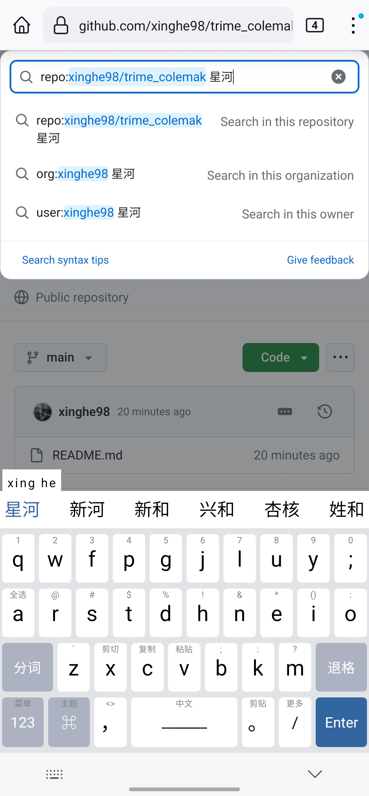
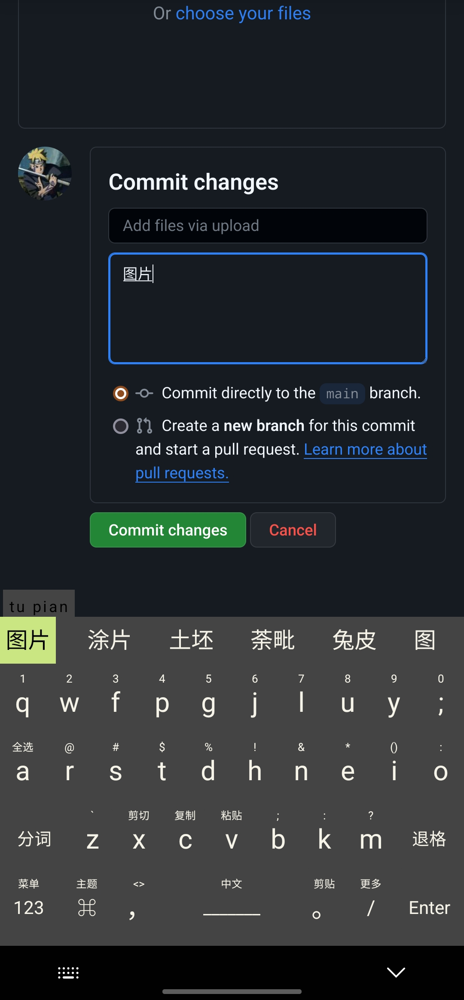

# trime_colemak

## 截图：

| 亮色                                 | 暗色                               |
| ------------------------------------ | ---------------------------------- |
|  |  |

## 使用方法

复制 rime 文件夹到手机根目录即可

## 自定义配色

修改`tongwenfeng_colemak.trime.yaml`中配色模块
